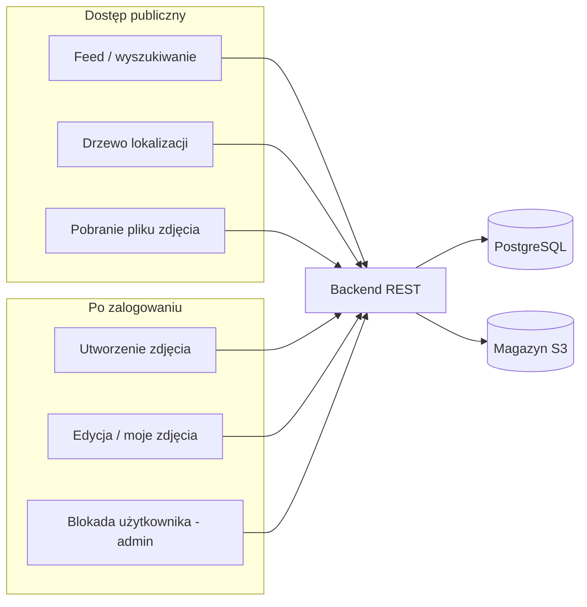
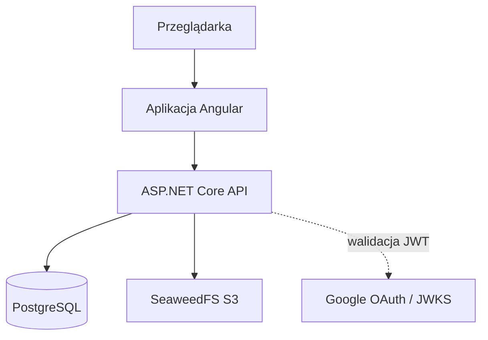
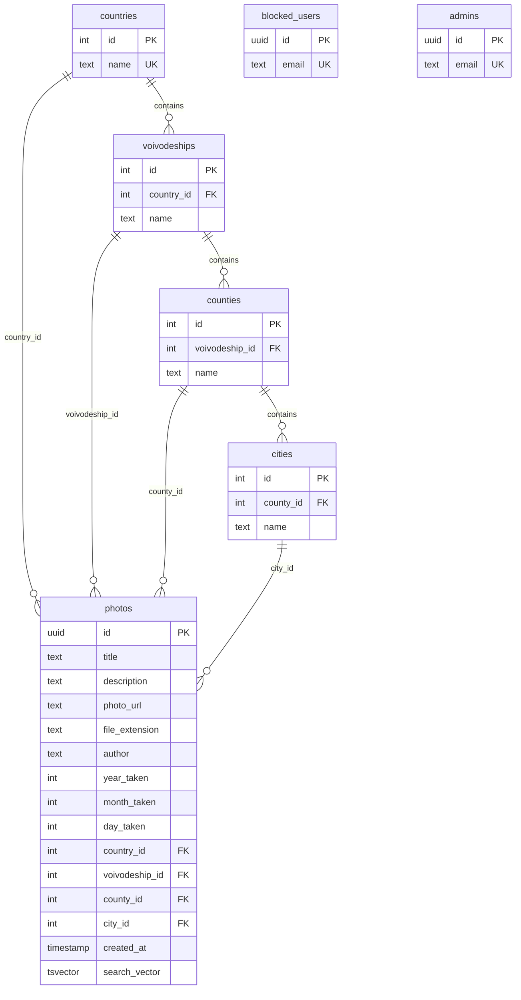

## 1. Cel systemu i zakres

Aplikacja umożliwia:

- przeglądanie i **wyszukiwanie zdjęć** (słowa kluczowe, zakres dat wykonania, lokalizacja terytorialna, autor),
- **dodawanie, edycję i usuwanie** własnych zdjęć po zalogowaniu (OAuth Google),
- **moderację** w postaci listy zablokowanych użytkowników i kont administratorów (zarządzane w bazie).

Dane binarne plików graficznych są przechowywane w magazynie zgodnym z API S3; rekordy opisujące zdjęcia i hierarchię lokalizacji — w PostgreSQL.

---

## 2. Uzasadnienie przyjętych rozwiązań

### 2.1. Podział na warstwy: frontend, API, baza, obiektowy magazyn

**Uzasadnienie:** Rozdzielenie odpowiedzialności pozwala niezależnie skalować serwowanie interfejsu, logiki biznesowej, zapytań strukturalnych i dużych plików. API REST ułatwia integrację i testowanie; klient SPA (Angular) daje interaktywny interfejs bez przeładowywania całej strony przy każdej akcji.

### 2.2. PostgreSQL jako baza relacyjna

**Uzasadnienie:**

- Silne wsparcie dla **integralności referencyjnej** (hierarchia kraj → województwo → powiat → miasto oraz powiązania ze zdjęciami).
- Natywne typy i indeksy do **wyszukiwania pełnotekstowego** (`tsvector`, indeks GIN) oraz **dopasowań przybliżonych** (`pg_trgm` dla tytułu).
- Rozszerzenie `unaccent` ujednolica zapytania niezależnie od polskich znaków diakrytycznych w treści indeksowanej do `search_vector`.

Wybór PostgreSQL 16 (w `database/docker-compose.yml`) wiąże się ze stabilnym ekosystemem narzędzi i dobrą integracją z Npgsql / Entity Framework Core.

### 2.3. Entity Framework Core i warstwa `DatabaseManager`

**Uzasadnienie:** ORM skraca czas implementacji typowych operacji CRUD i mapowania encji na tabele, przy zachowaniu możliwości precyzyjnego odwzorowania indeksów i typów PostgreSQL (np. `tsvector`). Logika wyszukiwania i walidacji hierarchii jest skupiona w `DatabaseManager`, co ogranicza rozrost kontrolerów i ułatwia utrzymanie.

### 2.4. Magazyn obiektów z interfejsem S3 (SeaweedFS w środowisku lokalnym)

**Uzasadnienie:** Pliki binarne nie powinny być trzymane w tabelach BLOB w PostgreSQL przy założeniu wzrostu wolumenu — taniej i prościej jest użyć magazynu obiektów. Klient AWS SDK (`StorageManager`) pozwala w produkcji podłączyć innego dostawcę S3 bez zmiany kontraktu aplikacji. W repozytorium lokalnie uruchamiany jest SeaweedFS z konfiguracją S3 (`database/docker-compose.yml`, `database/s3.json`).

### 2.5. Uwierzytelnianie: JWT z Google (OpenID Connect)

**Uzasadnienie:** Powierzenie tożsamości zaufanemu dostawcy (Google) eliminuje konieczność przechowywania haseł w bazie aplikacji i redukuje ryzyko związane z wyciekami credentiali. Backend waliduje token JWT (`JwtBearer` w `Program.cs`); tożsamość użytkownika w operacjach zapisu jest powiązana z adresem e-mail z tokena (pole `author` w rekordzie zdjęcia).

### 2.6. Angular (SPA) po stronie klienta

**Uzasadnienie:** Komponentowy model, routing z lazy loading (`app.routes.ts`), serwisy do komunikacji z API i spójna warstwa widoków ułatwiają rozbudowę (np. kolejne strony lub komponenty filtrów). TypeScript zwiększa czytelność kontraktów danych względem API.

### 2.7. Hierarchia terytorialna z pliku JSON i skryptu ładującego

**Uzasadnienie:** Struktura `polska_administracja.json` (kraj → województwa → powiaty → listy miejscowości) odpowiada naturalnemu podziałowi informacji o miejscu wykonania zdjęcia. Skrypt `scripts/load_data.py` pozwala odtworzyć lub zaktualizować słownik bez ręcznego wprowadzania tysięcy rekordów. Alternatywą byłoby bezpośrednie API zewnętrzne (np. TERYT) przy każdym żądaniu — przyjęto model **słownika w bazie** dla przewidywalnej wydajności i działania offline od usług zewnętrznych.

### 2.8. Strategia wyszukiwania

**Uzasadnienie:** Kombinacja `tsvector` + `plainto_tsquery` dla tytułu i opisu oraz dopasowania autora (`Contains`) daje balans między jakością wyników a złożonością. Filtrowanie po dacie w kodzie aplikacji (po pobraniu z bazy) dla pełnych zakresów z częściową datą (rok bez miesiąca itd.) upraszcza SQL przy zachowaniu semantyki „przedziału czasowego” opisanej w `DatabaseManager`.

---

## 3. Architektura informacji

### 3.1. Główne typy treści

| Typ treści        | Opis |
|-------------------|------|
| Kanał zdjęć       | Lista wyników wyszukiwania / domyślny widok (`/feed`). |
| Pojedyncze zdjęcie | Szczegóły i plik graficzny pobierane przez API (identyfikator UUID). |
| Metadane zdjęcia  | Tytuł, opis, data wykonania, lokalizacja (ID w hierarchii), autor. |
| Słownik lokalizacji | Drzewo: kraj → województwo → powiat → miasto (API `GET /api/Locations/all`). |
| Konto użytkownika | Stan zalogowania, rola (admin), ewentualna blokada (`/api/auth/me`). |

### 3.2. Nawigacja i ścieżki (routing frontendu)

- **`/feed`** — wejście domyślne; przeglądanie i filtrowanie zdjęć (w tym panel filtrów).
- **`/login`** — logowanie przez Google (inicjacja po stronie klienta, token do API).
- **`/create-photo`** — dodawanie zdjęcia (wymaga zalogowania, `loggedInGuard`).
- **`/edit-photo/:id`** — edycja metadanych (właściciel lub admin).
- **`/my-photos`** — zdjęcia zalogowanego użytkownika.

Niezgodne ścieżki są przekierowywane do `/feed`, co utrzymuje przewidywalny „hub” aplikacji.

### 3.3. Etykietowanie i grupowanie informacji

- **Filtrowanie** jest zgrupowane logicznie: tekst (słowa kluczowe), czas (od–do z możliwością częściowej daty), lokalizacja (kaskadowo zależna od drzewa), autor, sortowanie (np. najstarsze pierwsze).
- **Hierarchia lokalizacji** odzwierciedla język administracyjny użytkownika polskiego (województwo, powiat, miejscowość), co wspiera mentalny model „gdzie zostało zrobione zdjęcie”.

### 3.4. Przepływ informacji (uproszczony)

---

## 4. Architektura systemu

### 4.1. Komponenty logiczne

1. **Frontend Angular** (`frontend/`) — UI, walidacja formularzy, wywołania HTTP, guardy tras.
2. **Backend ASP.NET Core** (`backend/`) — kontrolery REST, autoryzacja JWT, orchestracja zapisu do bazy i magazynu.
3. **PostgreSQL** — metadane zdjęć, użytkownicy zablokowani, administratorzy, słownik terytorialny.
4. **Magazyn S3-kompatybilny** — treść binarna zdjęć; w bazie przechowywany jest **klucz obiektu** (`photo_url`), nie plik.

### 4.2. Główne endpointy API (skrót)

| Obszar        | Przykładowe trasy | Uwagi |
|---------------|-------------------|--------|
| Zdjęcia       | `GET /api/photos/search`, `GET /api/photos/{id}`, `GET /api/photos/file/{id}` | Wyszukiwanie i plik — dostęp anonimowy. |
| Zdjęcia — zapis | `POST /api/photos/create`, `POST /api/photos/edit`, `DELETE /api/photos/delete/{id}` | Wymaga JWT; tworzenie/edycja — polityka `NotBlocked`. |
| Lokalizacje   | `GET /api/Locations/all` | Drzewo z pamięcią podręczną po stronie serwera (pierwsze żądanie buduje JSON). |
| Uwierzytelnianie | `GET /api/auth/me`, `POST /api/auth/block` | `me` — stan konta; `block` — tylko admin. |

### 4.3. Przepływ zapisu nowego zdjęcia

1. Klient przekazuje metadane oraz `photoData` (np. base64 w JSON — zgodnie z modelem API).
2. Backend waliduje hierarchię lokalizacji względem bazy (`ValidateTerritorialHierarchy`).
3. Plik jest zapisywany w magazynie pod kluczem `photos/{googleSubject}/{photoId}`.
4. Rekord w tabeli `photos` otrzymuje m.in. `photo_url`, `author` (e-mail), pola czasu i lokalizacji; trigger aktualizuje `search_vector`.

### 4.4. Diagram wdrożeniowy (środowisko developerskie)

---

## 5. Model danych

### 5.1. Schemat konceptualny (ER)

Główne encje i powiązania:

### 5.2. Tabele słownikowe i administracyjne

- **`countries`, `voivodeships`, `counties`, `cities`** — hierarchia unikalna na odpowiednim poziomie (np. para `(voivodeship_id, name)` dla powiatu).
- **`blocked_users`** — e-maile użytkowników wyłączonych z tworzenia/edycji (polityka `NotBlocked`).
- **`admins`** — e-maile z uprawnieniami m.in. do blokowania innych użytkowników i edycji cudzych zdjęć (logika w kontrolerach).

### 5.3. Tabela `photos` — znaczenie pól

| Pole            | Znaczenie |
|-----------------|-----------|
| `id`            | UUID — stabilny identyfikator zasobu w API i magazynie. |
| `title`, `description` | Treść opisowa; uczestniczy w indeksie pełnotekstowym. |
| `photo_url`     | Klucz obiektu w magazynie S3 (nie publiczny URL zewnętrzny wprost do pliku, lecz identyfikator po stronie backendu). |
| `file_extension`| Rozszerzenie do wyboru typu MIME przy zwrocie pliku. |
| `author`        | E-mail właściciela (z tożsamości OAuth). |
| `year_taken`, `month_taken`, `day_taken` | Data wykonania; miesiąc i dzień mogą być puste (niepełna data). |
| `*_id` (lokalizacja) | Powiązania ze słownikiem; `country_id` obowiązkowe, niższe poziomy opcjonalne przy zachowaniu spójności hierarchii. |
| `created_at`    | Czas dodania rekordu; używany m.in. do sortowania wyników listy. |
| `search_vector` | Pole pochodne utrzymywane triggerem — wektor FTS dla `title` + `description`. |

### 5.4. Indeksy i spójność wyszukiwania

Zdefiniowane w `database/init.sql` m.in.:

- B-tree na kluczach lokalizacji i składowych daty — przyspieszanie filtrów równościowych / zakresów po roku.
- GIN na `search_vector` — wyszukiwanie pełnotekstowe.
- GIN z `gin_trgm_ops` na `title` — wsparcie dla zapytań częściowych (trigramy).

---

## 6. Struktura metadanych

W tym projekcie **metadane** to dane opisujące zasób (zdjęcie), odróżnione od **payloadu binarnego** przechowywanego w magazynie obiektów.

### 6.1. Warstwa „opisowa” zdjęcia (aplikacja)

| Element | Źródło prawdy | Uwagi |
|---------|----------------|-------|
| Tytuł i opis | Tabela `photos` | Edytowalne; wpływają na FTS przez trigger. |
| Data wykonania | Pola `year_taken`, `month_taken`, `day_taken` | Semantyka częściowej daty odzwierciedlona w logice zakresów w `DatabaseManager`. |
| Lokalizacja | Klucze obce do słownika | Identyfikatory numeryczne — stabilne odnośniki; nazwy są w tabelach słownika i w drzewie API. |
| Autor | Kolumna `author` | Identyfikacja konta (e-mail). |
| Typ pliku | `file_extension` | Powiązanie z nagłówkiem `Content-Type` przy serwowaniu pliku. |
| Powiązanie z plikiem | `photo_url` | Logiczny klucz w magazynie; nie jest to metadana EXIF z pliku — system opiera się na danych wprowadzonych przez użytkownika i zapisanych w bazie. |

### 6.2. Metadane pochodne w bazie

- **`search_vector`** — zmaterializowany, zsynchronizowany triggerem `tsvectorupdate` przed `INSERT`/`UPDATE`. Ułatwia to zapytania FTS bez kosztownego `to_tsvector` w każdym SELECT.

### 6.3. Metadane po stronie magazynu S3

Przy tworzeniu obiektu przekazywany jest słownik tagów (w kodzie — możliwość rozszerzenia); aktualnie endpoint tworzenia może wysłać pusty zestaw tagów. **Głównym nośnikiem metadanych biznesowych pozostaje PostgreSQL**, co ułatwia spójne zapytania i transakcyjność zapisu rekordu po udanym uploadzie.

### 6.4. Kontrakty API (DTO / modele frontu)

- Backend eksponuje modele takie jak `PhotoResponseModel`, `CreatePhotoModel`, `SearchPhotosQuery` (`backend/Models/`, kontrolery).
- Frontend definiuje odpowiedniki TypeScript (`frontend/src/app/models/`), co dokumentuje oczekiwany kształt JSON w komunikacji z API.

---

## 7. Analiza dostępności informacji

### 7.1. Dostępność danych wg roli i stanu konta

| Zasób / operacja | Anonimowy | Zalogowany (aktywny) | Zalogowany (zablokowany) | Administrator |
|------------------|-----------|----------------------|---------------------------|---------------|
| Wyszukiwanie zdjęć, metadane w liście | Tak | Tak | Tak | Tak |
| Pobranie pliku zdjęcia | Tak | Tak | Tak | Tak |
| Utworzenie / edycja zdjęcia | Nie | Tak | Nie (polityka `NotBlocked`) | Tak (o ile nie zablokowany) |
| Usunięcie zdjęcia | Nie | Tylko własne | — | Tak (również cudze) |
| Informacja o koncie (`/auth/me`) | Nie | Tak | Tak (widoczność flag) | Tak |
| Blokada użytkownika | Nie | Nie | Nie | Tak |

**Wnioski:** Treść zbiorcza (katalog zdjęć) jest **publicznie odczytywalna**, co maksymalizuje dostępność informacji dla odbiorcy końcowego. Operacje modyfikujące wymagają uwierzytelnienia; dodatkowo polityka `NotBlocked` ogranicza możliwość zaśmiecania serwisu przez konta wyłączone z moderacji.

### 7.2. Spójność i aktualność

- **Słownik lokalizacji** w API `Locations/all` jest **cache’owany w pamięci procesu** po pierwszym zbudowaniu drzewa — zmniejsza obciążenie bazy, ale po zmianach w tabelach geograficznych wymaga restartu procesu API, aby odświeżyć odpowiedź (świadomy kompromis wydajnościowy).
- **Wyszukiwanie:** część filtrowania daty realizowana jest w pamięci po pobraniu zestawu z SQL — przy bardzo dużej liczbie rekordów może to stać się wąskim gardłem; obecny projekt zakłada skalę akademicką / średnią.

### 7.3. Dostępność jako „inclusive design” (UI)

We frontendzie przewidziano m.in. zamykanie paneli bocznych klawiszem Escape (`FeedComponent`) — to prosty element wspierający użytkowanie klawiaturą.

---
